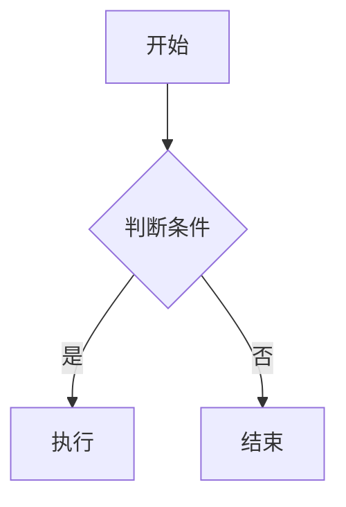
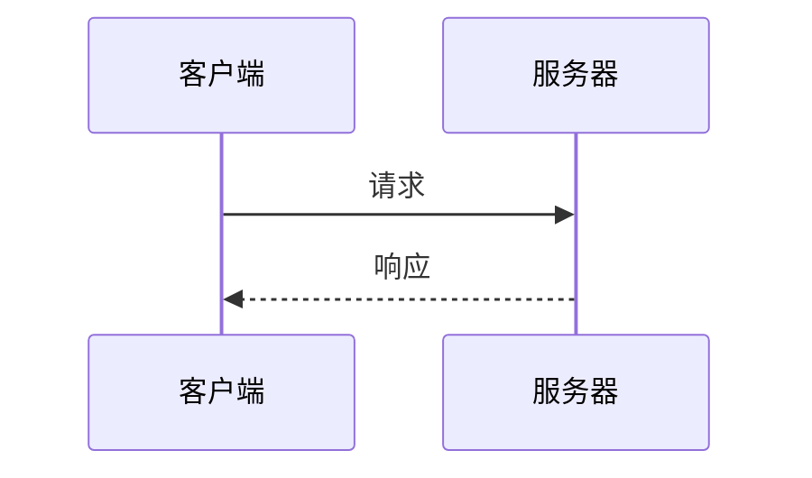

# markdown-export — MPE 风格 Markdown 导出

> 将 Markdown 文件以 MPE（Markdown Preview Enhanced）风格导出为 PDF / PNG / JPG。

## ✨ 特性

### 基础功能
- **PDF 导出** — A4 格式，含代码背景色、表格边框、打印优化
- **PNG 截图** — 全页面截图，2x 分辨率
- **JPG 截图** — 同上，JPEG 格式（文件更小）
- **代码高亮** — 支持 190+ 语言（GitHub Light 风格）
- **中文字体** — 优先使用系统雅黑 / 苹方 / Noto
- **MPE 行为一致** — 输出路径与源文件同目录、同文件名，仅扩展名不同
- **深色模式** — 自动适配系统深色模式

### 高级功能（v1.1.0 新增）

| 功能 | 语法 | 说明 |
|------|------|------|
| 📐 **KaTeX 数学公式** | `$...$` 行内 / `$$...$$` 块级 | 自动渲染 LaTeX 公式 |
| 🔀 **Mermaid 图表** | ` ```mermaid ` 代码块 | 流程图、时序图、甘特图等 |
| 📋 **YAML Front-matter** | `---` 开头的文档元数据 | 封面图、标题、作者、摘要 |
| ✅ **任务列表美化** | `- [ ]` / `- [x]` | 圆角图标，已完成划线 |

## 安装

```bash
# via SkillHub（推荐）
skillhub install markdown-export

# 或手动安装
npm install
```

> 无需安装 Chromium — `puppeteer-core` 会使用系统已安装的 Chrome。

## 使用方式

### Agent 调用

Agent 加载此 skill 后，通过 Python `subprocess` 调用核心脚本：

```python
import subprocess, os, sys

skill_dir = r"{workspace_root_dir}\skills\markdown-export"
script = os.path.join(skill_dir, "scripts", "export.js")
input_md = r"C:\path\to\README.md"

result = subprocess.run(
    ["node", script, input_md],
    capture_output=True, text=True, timeout=120
)

if result.returncode == 0:
    output_path = result.stdout.strip()
    print(f"导出成功: {output_path}")
else:
    print(f"失败: {result.stderr}")
```

### CLI 单独使用

```bash
# PDF（默认）
node scripts/export.js README.md

# 指定格式
node scripts/export.js README.md pdf
node scripts/export.js README.md png
node scripts/export.js README.md jpg
```

## 高级功能详解

### 📐 KaTeX 数学公式

使用 CDN 加载 KaTeX，行内公式和块级公式均支持：

```
行内公式：勾股定理 $a^2 + b^2 = c^2$，居中显示如下：

块级公式：
$$
E = mc^2
$$
```

> KaTeX CDN 需要网络连接。离线环境下块级公式会显示 LaTeX 源码，行内公式不变。

### 🔀 Mermaid 流程图 / 时序图 / 甘特图

使用 ` ```mermaid ` 代码块，自动渲染为 SVG：

````



````

支持类型：flowchart / graph、sequenceDiagram、gantt、classDiagram、stateDiagram、erDiagram、pie 等。

### 📋 YAML Front-matter

文档开头用 `---` 分隔的元数据会自动解析为页面元素：

```yaml
---
title: 我的文档标题
author: 张三
date: 2025-04-10
abstract: 这是文档摘要，会以特殊样式显示。
cover: https://example.com/cover.jpg
---
```

| 字段 | 渲染效果 |
|------|---------|
| `title` | 页面第一行大标题 |
| `cover` | 页面顶部封面图（超出部分裁切） |
| `author` / `date` | 标题下方元信息栏 |
| `abstract` / `description` | 左侧竖线装饰的摘要段落 |

### ✅ 任务列表美化

Markdown 原生的任务列表语法会自动美化：

```
- [ ] 待办事项（空心方块）
- [x] 已完成事项（绿色勾号 + 文字划线）
```

## 渲染效果说明

| 特性 | 说明 |
|------|------|
| 页面宽度 | max-width: 900px，居中 |
| 字体 | 中文优先雅黑/苹方/Noto，代码等宽字体 |
| 代码块 | GitHub Light 风格语法高亮，含背景色 |
| 表格 | 边框、斑马纹、响应式 |
| 引用/HR | 标准 GitHub Markdown 风格 |
| 打印 | A4 边距 1.5cm/2cm，代码背景色保留 |
| 深色模式 | 自动适配系统深色模式 |

## 注意事项

- 输入必须是 `.md` 文件
- Chrome 必须已安装（脚本会自动搜索系统路径）
- **数学公式 / Mermaid**：依赖 CDN 加载，需联网使用
- **封面图**：使用网络图片 URL，离线时显示占位
- **打印 PDF**：深色 Mermaid 图表在打印时会切换为浅色主题

## 开源协议

本项目基于 [MIT License](LICENSE) 开源。
